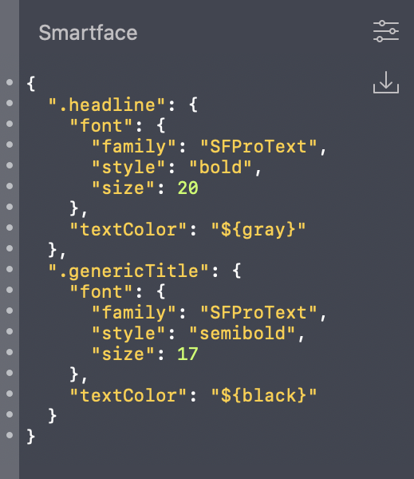
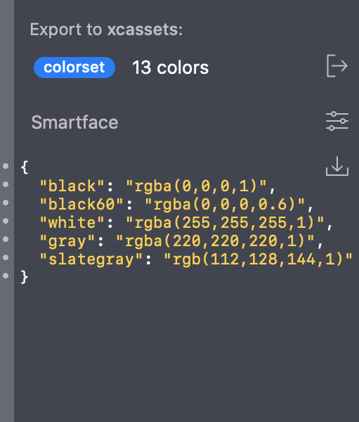

<h3 align="center">
  
</h3>

# Smartface Zeplin Extension

Generating Smartface themes from Zeplin projects has never been easier!

- Install Smartface extension from Zeplin [extension center](https://extensions.zeplin.io/)
- Go to styleguide of your Zeplin project
- Select **Color Palette**
- See **Smartface** tab on the right



- If you click **Export** button on the right, [variables.json](https://developer.smartface.io/docs/using-themes-in-apps#section-inheritance-with-variables) will be created automatically which is ready to use in your Smartface app themes
- Same also applies for text styles as well



Sample variables output:
```js
{
  "black": "rgba(0,0,0,1)",
  "black60": "rgba(0,0,0,0.6)",
  "white": "rgba(255,255,255,1)",
  "gray": "rgba(220,220,220,1)",
  "slategray": "rgb(112,128,144,1)"
}
```

Sample text style output:
```js
{
  ".headline": {
    "font": {
      "family": "SFProText",
      "style": "bold",
      "size": 20
    },
    "textColor": "${gray}"
  },
  ".genericTitle": {
    "font": {
      "family": "SFProText",
      "style": "semibold",
      "size": 17
    },
    "textColor": "${black}"
  }
}
```

## Development

Smartface extension is developed using [zem](https://github.com/zeplin/zem), Zeplin Extension Manager. zem is a command line tool that lets you quickly create and test extensions.

To learn more about zem, [see documentation](https://github.com/zeplin/zem).